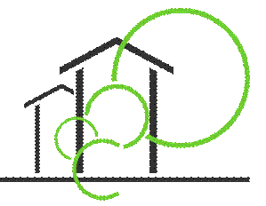

# eeE-BIM-API

<html>

<head>
<meta http-equiv=Content-Type content="text/html; charset=windows-1252">
<meta name=Generator content="Microsoft Word 12 (filtered)">
<title>Jotne eeEmbedded BIM Model Server</title>

</head>

<body lang=NO-BOK link=blue vlink=purple>

eeEmbedded BIM Model Server IFC API

&nbsp;

<table class=MsoNormalTable border=1 cellspacing=0 cellpadding=0
 style='border-collapse:collapse;border:none'>
 <tr>
  <td width=415 style='width:311.45pt;border:solid windowtext 1.0pt;padding:
  0cm 5.4pt 0cm 5.4pt'>
  
OPTIMISED DESIGN METHODOLOGIES FOR ENERGY-EFFICIENT
  BUILDINGS INTEGRATED IN THE NEIGHBOURHOOD ENERGY SYSTEMS

  </td>
  <td width=180 style='width:134.7pt;border:solid windowtext 1.0pt;border-left:
  none;padding:0cm 5.4pt 0cm 5.4pt'>
  

  </td>
 </tr>
 <tr>
  <td width=415 style='width:311.45pt;border:solid windowtext 1.0pt;border-top:
  none;padding:0cm 5.4pt 0cm 5.4pt'>
  
This project has
  received funding from the European Union Seventh Framework Programme under
  grant agreement n° 609349

  </td>
  <td width=180 style='width:134.7pt;border-top:none;border-left:none;
  border-bottom:solid windowtext 1.0pt;border-right:solid windowtext 1.0pt;
  padding:0cm 5.4pt 0cm 5.4pt'>
  

  </td>
 </tr>
 <tr>
  <td width=415 style='width:311.45pt;border:solid windowtext 1.0pt;border-top:
  none;padding:0cm 5.4pt 0cm 5.4pt'>
  
<b>Server built
  upon upon EDMModelServer ™ from </b>

  </td>
  <td width=180 style='width:134.7pt;border-top:none;border-left:none;
  border-bottom:solid windowtext 1.0pt;border-right:solid windowtext 1.0pt;
  padding:0cm 5.4pt 0cm 5.4pt'>
  

  </td>
 </tr>
 <tr>
  <td width=415 style='width:311.45pt;border:solid windowtext 1.0pt;border-top:
  none;padding:0cm 5.4pt 0cm 5.4pt'>
  
<b>Server
  powered by</b>

  </td>
  <td width=180 valign=top style='width:134.7pt;border-top:none;border-left:
  none;border-bottom:solid windowtext 1.0pt;border-right:solid windowtext 1.0pt;
  padding:0cm 5.4pt 0cm 5.4pt'>
  

  </td>
 </tr>
</table>

Version Timestamp:&nbsp; 0.1 / 03.02.2016  Nature:&nbsp; Draft

Contents

<a href="#_Toc442261355">1     About this server. 1</a>

<a href="#_Toc442261356">2.1&nbsp;&nbsp;&nbsp;&nbsp;&nbsp;&nbsp;&nbsp;&nbsp;
Administrative information. 1</a>

<a href="#_Toc442261357">Executive Summary. 2</a>

&nbsp;

<h1>The IFC-API</h1>

The purpose if the eeE-IFC-API is to
provide a general web interface for accessing IFC model server functionality.

It is sponsored and developed as a part of
the eeEmbedded project, see section below.

The interface is presented as a set of web
services using REST and JSON as design foundations. The services are documented
<a href="doc/README.md">here</a>

<h2 style='margin-left:0cm;text-indent:0cm'><a name="_Toc442261356">The eeEmbedded project</a></h2>

&nbsp;

Project Coordinator: R. J. Scherer, Institute for
Construction Informatics, Technische Universität Dresden, Germany

&nbsp;

<a name="_Toc374097650"><em>Page History</em></a>

<table class=MsoNormalTable border=0 cellspacing=0 cellpadding=0 width=603
 style='width:452.15pt;margin-left:6.1pt;border-collapse:collapse'>
 <tr>
  <td width=72 valign=top style='width:53.9pt;border:solid windowtext 1.0pt;
  background:#D9D9D9;padding:0cm 5.4pt 0cm 5.4pt'>
  
<b>Version</b>

  </td>
  <td width=249 valign=top style='width:186.4pt;border:solid windowtext 1.0pt;
  border-left:none;background:#D9D9D9;padding:0cm 5.4pt 0cm 5.4pt'>
  
<b>Description</b>

  </td>
  <td width=200 valign=top style='width:150.25pt;border:solid windowtext 1.0pt;
  border-left:none;background:#D9D9D9;padding:0cm 5.4pt 0cm 5.4pt'>
  
<b>Lead Author</b>

  </td>
  <td width=82 valign=top style='width:61.6pt;border:solid windowtext 1.0pt;
  border-left:none;background:#D9D9D9;padding:0cm 5.4pt 0cm 5.4pt'>
  
<b>Date</b>

  </td>
 </tr>
 <tr>
  <td width=72 valign=top style='width:53.9pt;border:solid windowtext 1.0pt;
  border-top:none;padding:0cm 5.4pt 0cm 5.4pt'>
  
0.2

  </td>
  <td width=249 valign=top style='width:186.4pt;border-top:none;border-left:
  none;border-bottom:solid windowtext 1.0pt;border-right:solid windowtext 1.0pt;
  padding:0cm 5.4pt 0cm 5.4pt'>
  
Initial
  prototype

  </td>
  <td width=200 valign=top style='width:150.25pt;border-top:none;border-left:
  none;border-bottom:solid windowtext 1.0pt;border-right:solid windowtext 1.0pt;
  padding:0cm 5.4pt 0cm 5.4pt'>
  
Arne Tøn ( EPM)

  </td>
  <td width=82 valign=top style='width:61.6pt;border-top:none;border-left:none;
  border-bottom:solid windowtext 1.0pt;border-right:solid windowtext 1.0pt;
  padding:0cm 5.4pt 0cm 5.4pt'>
  
18.06.2015

  </td>
 </tr>
 <tr>
  <td width=72 valign=top style='width:53.9pt;border:solid windowtext 1.0pt;
  border-top:none;padding:0cm 5.4pt 0cm 5.4pt'>
  
1.2

  </td>
  <td width=249 valign=top style='width:186.4pt;border-top:none;border-left:
  none;border-bottom:solid windowtext 1.0pt;border-right:solid windowtext 1.0pt;
  padding:0cm 5.4pt 0cm 5.4pt'>
  
&nbsp;

  </td>
  <td width=200 valign=top style='width:150.25pt;border-top:none;border-left:
  none;border-bottom:solid windowtext 1.0pt;border-right:solid windowtext 1.0pt;
  padding:0cm 5.4pt 0cm 5.4pt'>
  
&nbsp;

  </td>
  <td width=82 valign=top style='width:61.6pt;border-top:none;border-left:none;
  border-bottom:solid windowtext 1.0pt;border-right:solid windowtext 1.0pt;
  padding:0cm 5.4pt 0cm 5.4pt'>
  
&nbsp;

  </td>
 </tr>
 <tr>
  <td width=72 valign=top style='width:53.9pt;border:solid windowtext 1.0pt;
  border-top:none;padding:0cm 5.4pt 0cm 5.4pt'>
  
1.3

  </td>
  <td width=249 valign=top style='width:186.4pt;border-top:none;border-left:
  none;border-bottom:solid windowtext 1.0pt;border-right:solid windowtext 1.0pt;
  padding:0cm 5.4pt 0cm 5.4pt'>
  
&nbsp;

  </td>
  <td width=200 valign=top style='width:150.25pt;border-top:none;border-left:
  none;border-bottom:solid windowtext 1.0pt;border-right:solid windowtext 1.0pt;
  padding:0cm 5.4pt 0cm 5.4pt'>
  
&nbsp;

  </td>
  <td width=82 valign=top style='width:61.6pt;border-top:none;border-left:none;
  border-bottom:solid windowtext 1.0pt;border-right:solid windowtext 1.0pt;
  padding:0cm 5.4pt 0cm 5.4pt'>
  
&nbsp;

  </td>
 </tr>
 <tr>
  <td width=72 valign=top style='width:53.9pt;border:solid windowtext 1.0pt;
  border-top:none;padding:0cm 5.4pt 0cm 5.4pt'>
  
1.4

  </td>
  <td width=249 valign=top style='width:186.4pt;border-top:none;border-left:
  none;border-bottom:solid windowtext 1.0pt;border-right:solid windowtext 1.0pt;
  padding:0cm 5.4pt 0cm 5.4pt'>
  
&nbsp;

  </td>
  <td width=200 valign=top style='width:150.25pt;border-top:none;border-left:
  none;border-bottom:solid windowtext 1.0pt;border-right:solid windowtext 1.0pt;
  padding:0cm 5.4pt 0cm 5.4pt'>
  
&nbsp;

  </td>
  <td width=82 valign=top style='width:61.6pt;border-top:none;border-left:none;
  border-bottom:solid windowtext 1.0pt;border-right:solid windowtext 1.0pt;
  padding:0cm 5.4pt 0cm 5.4pt'>
  
&nbsp;

  </td>
 </tr>
</table>

<h3><a name="_Toc442261357">Executive
Summary</a></h3>

This server contains web applications and
documents related to the EDMmodelServer™ from Jotne provides as one of the BIM
Model Servers in the eeEmbedded project. &nbsp;The server is provided as an
server instance available for the duration of the project, and not as a
product. 

Partners has
contributed from their expert viewpoint as follows:

·&nbsp;&nbsp;&nbsp;&nbsp;&nbsp;
<b>EPM:</b>
&nbsp;&nbsp;&nbsp;&nbsp;&nbsp;&nbsp; Responsible for providing necessary
hardware, software and supporting components to make the server available.

·&nbsp;&nbsp;&nbsp;&nbsp;&nbsp;
<b>NEM:&nbsp;&nbsp;&nbsp;&nbsp; </b>Specification of the eeE BIM API implemented on the server

·&nbsp;&nbsp;&nbsp;&nbsp;&nbsp;
<b>IAB: </b>&nbsp;&nbsp;&nbsp;&nbsp;&nbsp;&nbsp;&nbsp;Specification
of the eeE BIM API implemented on the server

·&nbsp;&nbsp;&nbsp;&nbsp;&nbsp;
<b>CIB:&nbsp;&nbsp;&nbsp;&nbsp;&nbsp; &nbsp;&nbsp;</b>Input to specification and implementation

·&nbsp;&nbsp;&nbsp;&nbsp;&nbsp;
<b>XXX:&nbsp;&nbsp;&nbsp;&nbsp;&nbsp; </b>contributions to parts xxx

·&nbsp;&nbsp;&nbsp;&nbsp;&nbsp;
<b>ALL Partners</b>: Providing
feedback and evaluation

&nbsp;

<em>&nbsp;</em>

<em>Copyright</em>

This
report is © <i>ee</i>Embedded Consortium 2014. Its duplication is restricted to
the personal use within the consortium, the funding agency and the project
reviewers. Its duplication is allowed in its integral form only for anyone's
personal use for the purposes of research or education.

<a name="_Toc374097652"><em>Citation</em></a>

XXX
(2015); <i>ee</i>Embedded Deliverable xxx: Jotne BIM Model Server, © <i>ee</i>Embedded
Consortium, Brussels.

&nbsp;

<a name="_Toc374097653"><em>Acknowledgements</em></a>

The work presented
on this server has been conducted in the context of the seventh framework
programme of the European community project <i>ee</i>Embedded (n° 609349). <i>ee</i>Embedded
is a 48 month project that started in October 2013 and is funded by the
European Com­mission as well as by the industrial partners. Their support is
gratefully appreciated. The partners in the project are Technische Universität
Dresden (Germany), Fraunhofer-Gesellschaft zur Förderung der angewandten
Forschung E.V (Germany), &nbsp;NEMETSCHEK Slovensko, S.R.O. (Slovakia), Data
Design System ASA (Norway), RIB Information Technologies AG (Germany), Jotne
EPM Technology AS (Norway), Granlund OY (Finland), SOFISTIK HELLAS AE (Greece),
Institute for applied Building Informatics IABI (Germany), FR. SAUTER AG
(Switzerland), , Obermeyer Planen + Beraten (Germany), Centro de Estudios
Materiales y Control de Obras S.A. (Spain), STRABAG AG (Austria) and
Koninklijke BAM Group NV (The Netherlands). This report owes to a collaborative
effort of the above organizations.

&nbsp;

&nbsp;

</body>

</html>
